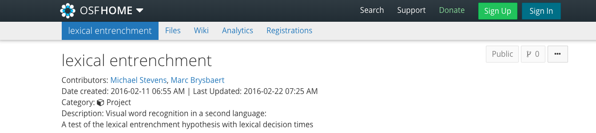
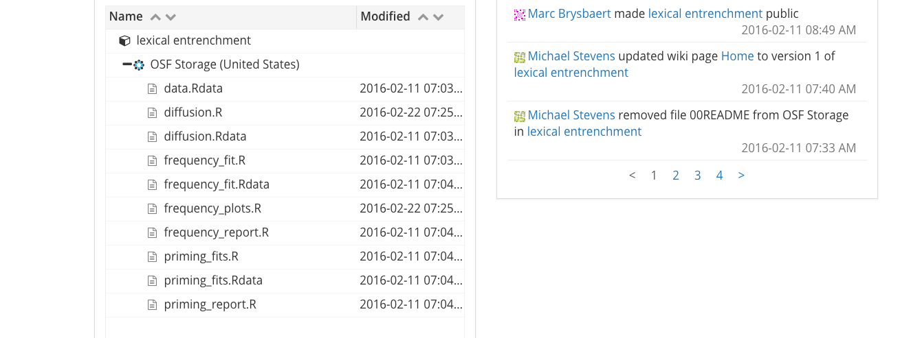
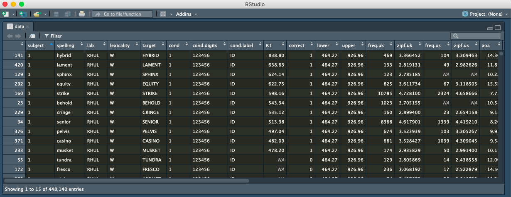
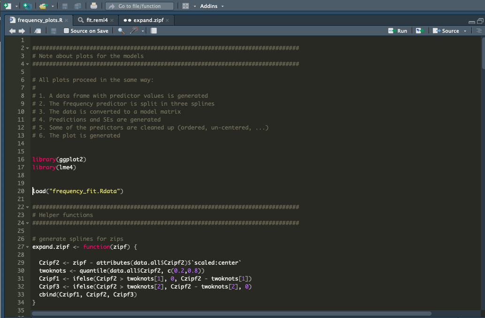
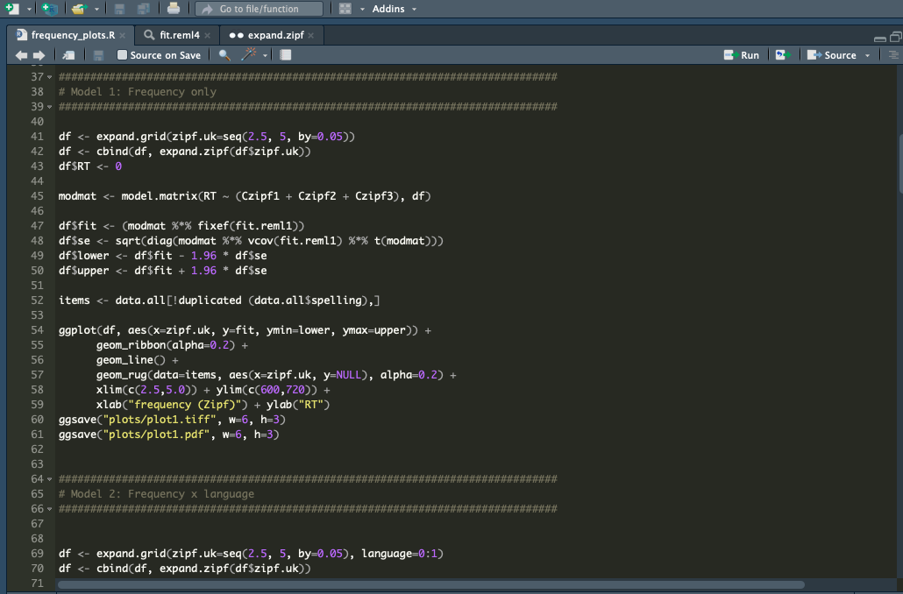
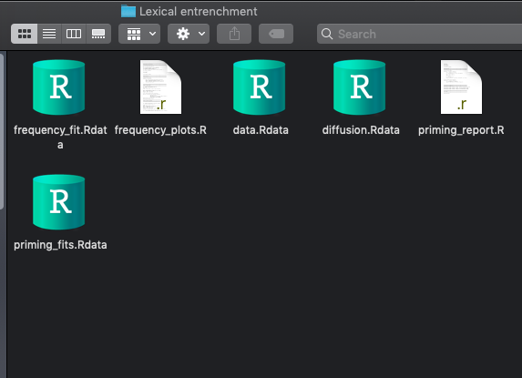

# L2 processing

--
- There is a larger word frequency effect in bilinguals than in monolinguals (Diependaele, Lemhöfer, & Brysbaert (2013)

--
  - Some researchers believe that this is evidence for two different processing paths for the L1 and L2.

---

# The lexical entrenchment account 

--
- Yap et al. (2012) reported that monolingual individuals with a small vocabulary size have a larger frequency effect than people with a large vocab size.

--
  - Could the difference in the frequency effect bw bilinguals and monolinguals be explained by the fact that people have a smaller vocab size in the L2 than in the L1?

--
  - Diependale et al. (2013) examined whether the frequency effect in bilinguals was due to a qualitative distinction bw L1 and L2 processing. Once vocab size was entered as a covariate in their analysis, all differences bw bilinguals and monolinguals disappeared. Bilinguals showed a larger effect , not bc they were processing words in L2, but because they had a smaller L2 vocab than L1 speakers. L2 speakers and l1 speakers with matched vocab sizes showed similar word freq effects.

---

# The lexical entrenchment account: the basics 

--
- Diependaele et al. (2013) claimed that:

--
- there is no difference bw L1 and L2 processing  

--
- Any differences could be explained by variations in exposure

--
- Exposure could be measured through vocab size tests

--
- Participants exposed to less language have a smaller vocab

--
- Smaller vocab size = stronger word freq size

--
- Once this is considered, the differences bw L1 and L2 speakers disappear
 

---

# RQ and hyp

--

- The same as Diependaele et al. (2013).

--

  - Why?
  
--

- Because the aforementioned study only had 21 participants. Therefore, they decided to extend Adelman et al.'s (2014) study tested 1011 English monolingual speakers on 420 six-letter words by extending it to bilingual populations.

--
  
  - They added 56 Dutch-English bilinguals.
  
---

# Materials

- Lexical decision task with 420 words and 420 nonwords, all 6 letters long.

- Vocab size test (SUBTLEX-UK)

---

# Results and discussion

--
- Participants with the lowest vocab sizes were 64 ms slower than the participants with the highest vocab sizes.

--
- Therefore, the WFE was larger for participants with a small vocab than for participants with a large vocab.

--
- After adding vocab size, the interaction bw frequency and language was not significant any more.

--
- Conclusion: bilinguals show a stronger WFE in L2 than in L1, only because they have a more limited exposure to L2 than to L1, resulting in a smaller vocab size.

---
# Is the data publicly available?

--

- yes!.

--

---
# Where are the supplementary materials stored?

- Folders on OSF

---
# Do the supplementary materials include instructions for reproducing the results (i.e., a codebook, README files, etc.)?
- Not at all, unfortunately :(

---
# Is the software used to analyze the data open source?
- Yes, Brysbaert et al. (2017) used R to analyze the data.

---
# Can you run the code without errors?

- Yes!

---

# Are you able to reproduce the plots and tables?

- Yeaaahhh!

--

---

---

# Are you able to reproduce the statistical analyses? Are your results the same as the results in the manuscript?

-I am afraid my knowledge of statistical analyses is too basic to run the statistics :(

---

# What other materials are available? 

- .R files and .Rdata files mainly.

--

---

# Using a scale from 1 to 10, give the article an open science score. 

--
- 6

--
## Justify your evaluation

- Main critique: NO README FILE!
- The title on OSF a) does not match that of the actual article; b) the name of the two other authors are not included on the OSF site.
- Comments on the ggplots were not very descriptive or helpful.

---

# Thanks for your attention!